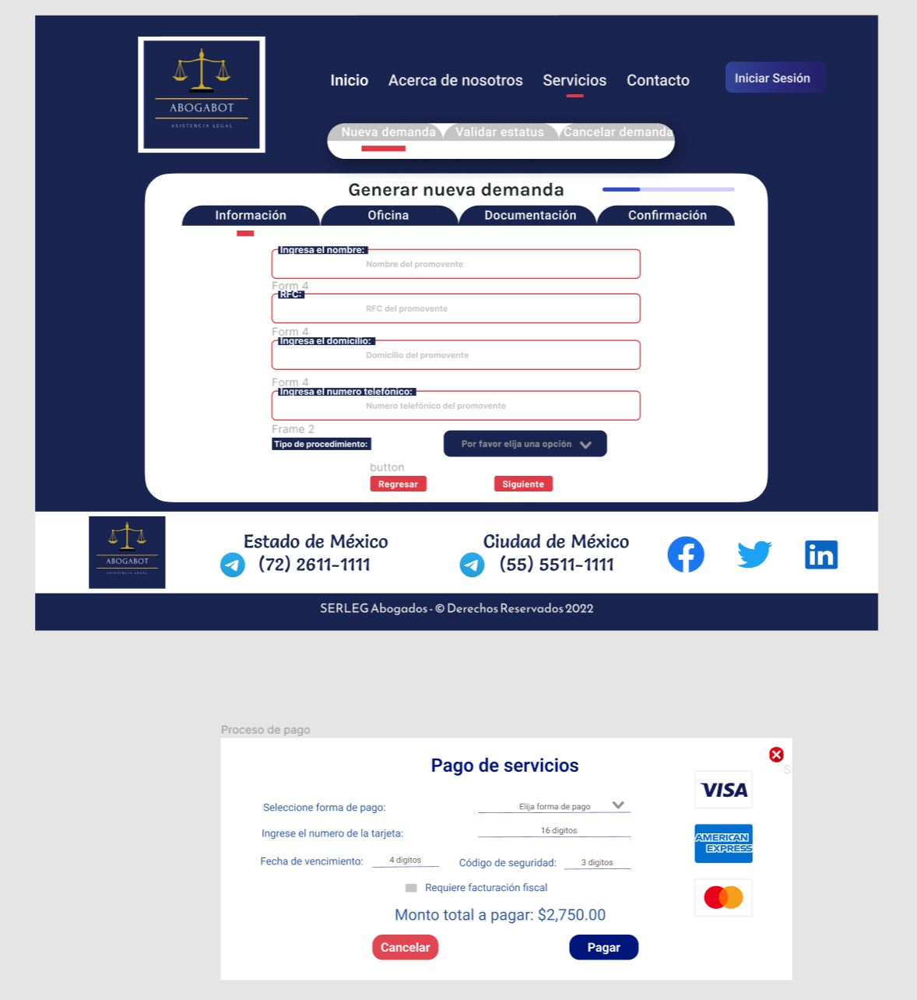
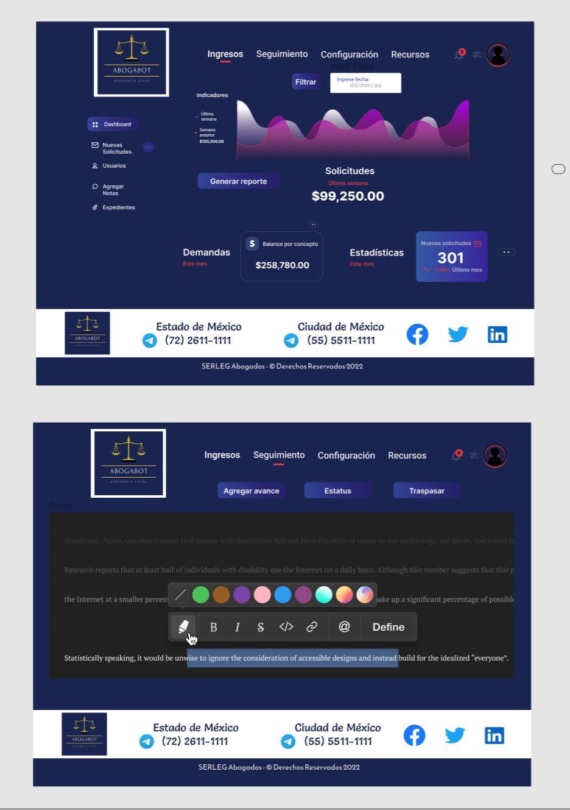

# Acerca del wireframe UI

Tomando como prioridad los requerimientos del cliente, se diseñó una opción considerando los colores deseados, con la integración de algunos colores destacados, en secciones específicas, acorde a la base en azul con blanco, sin que estas adiciones reduzcan la presencia principal de los principales. Con base en el Wireframe UX, se priorizo las disposición de elementos de interés para el usuario, destacando las opciones que fueron identificadas en los requerimientos, además de mantener una imagen acorde a lo servicios que brinda el cliente, con un enfoque de profesionalismo y seriedad.

## Características

Se puede destacar dentro del Wireframe UI:

* En el Wireframe de inicio, se prevé incluir un carrusel con imágenes de fondo que den al usuario un mejor panorama de la estructura operativa del cliente.
* Los botones de mayor relevancia (ejem. "registrarse" e "inicio de sesión") para el uso del sitio cuentan con gradientes, destacándolo así dentro de las demás.
* El diseño del logo mantiene los colores deseados por el cliente, aunque sencillo, transmite el sentido de servicio al que está orientado el sistema.
* Dentro de la sección de dashboard, como administrador puede visualizar el balance de ingresos, con la opción de generar reportes, incluir periodos específicos y las comparativas entre estas.

## Diseño

Inicio:

Usuario:

Administrador:

## Herramienta utilizada

Diseño realizado en Figma

Enlace: https://www.figma.com/file/zJxMVBFwj05wopQhzV82Wt/ABOGABOT-UI-DIR?node-id=0%3A1
