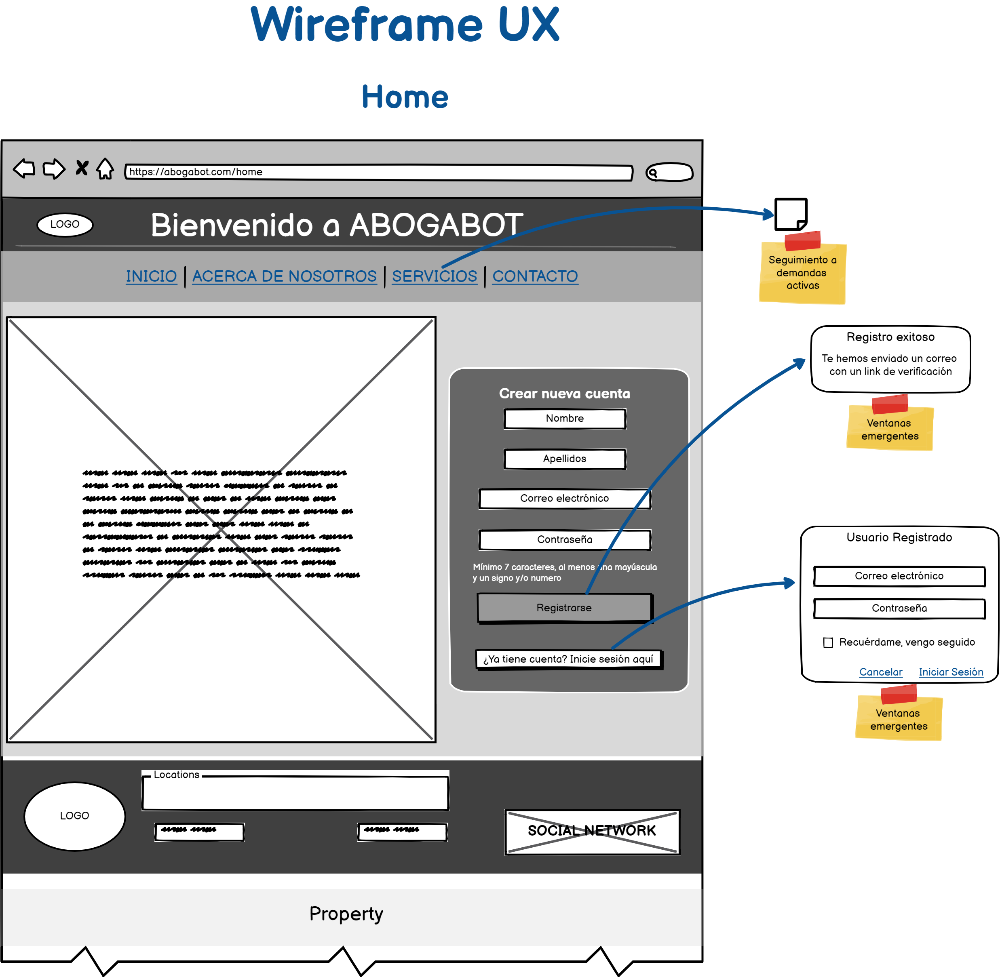
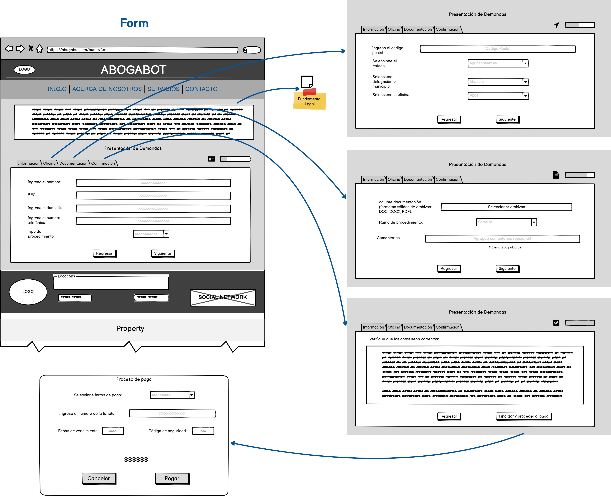
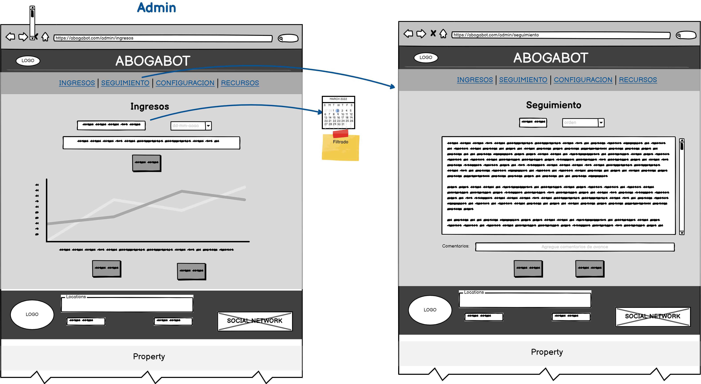

# Acerca del wireframe UX

El diseño tiene como base el generar una percepción positiva en el usuario, de forma que, al interactuar con el sistema ABOGABOT sea amigable y fácil de navegar, contando con las opciones de mayor relevancia a la vista, dando pie a que el usuario interactÚe con el sistema sin que este sea abrumador, con la finalida de cumplir con el análisis de requerimientos.

## Características

Se puede destacar dentro del Wireframe UX:

* Las opciones de registrarse e inicio de sesión que sobresalen, de modo que el usuario pueda acceder a estas como primera opción.
* La página de inicio cuenta con elementos básicos pero lo suficiente para lo que requiere al utilizar el sistema ABOGABOT.
* Dentro del menú, se dio atencion especial a lo que el cliente requiere para los usuarios, promoviendo la eficiencia y eficacia en la atencion a estos.

## Diseño

Inicio:

Usuario:

Administrador:

## Herramienta utilizada

Diseño realizado en Balsamik

Enlace: https://balsamiq.cloud/skur3mr/p4h470u

